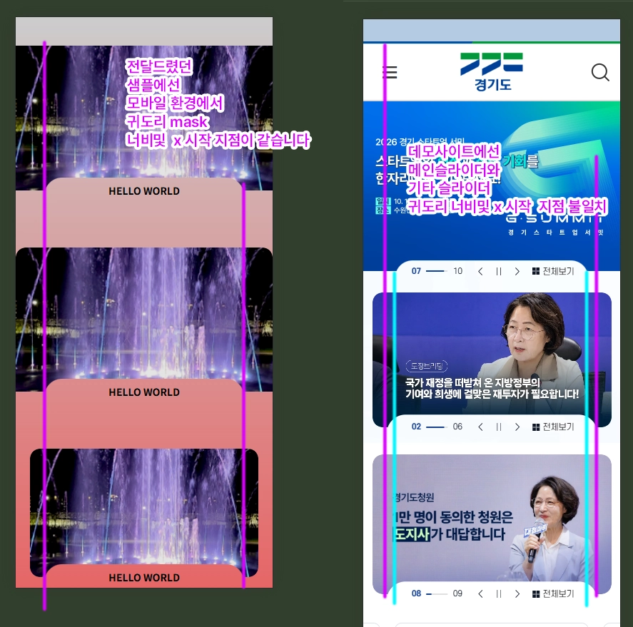
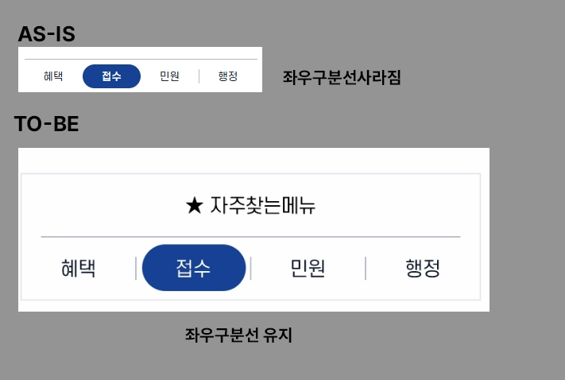

# 경기도청 메인화면 수정요청 MOBILE
- 2026-10-06

## 공통사항
- PC가 아닌 **MOBILE 수정사항**입니다.
- 최종 반영사항이 디자인 psd 파일과 느낌과 같게 반영 부탁드립니다.
- 빠른 수정사항 작성 및 현 작성 코드와 꼬임 방지를 위해 현재 css selector를 반영하지 않았습니다. **css selector는 의미 전달용**임을 참고해주세요.
- 전달드린 수정요청 사항에 대해 설명이 부족하거나 이해가 잘 가지 않으셨을시 추가 설명 요청 부탁드립니다.

# 상단 기상청 배너 영역
모바일에서 비율이 360/77 로 보이면 되는거였는데 실질적으로 반영이 되지 않았습니다. 부모 DOM에 고정값 height:150px 해제하셨으니 이미지에는 aspect-ratio 반영하실 필요 없습니다.
```css
@media (max-width: 992px) {
    .gg-top-banner__image {
        /* object-fit: none; */
        /* aspect-ratio: 360 / 77; */
        width: 100%;
        height: auto;
    }
}
```
# 슬라이더 귀도리 관련 - x좌표 관련
- 이미지 참고 부탁드립니다.
- 소스 참고: 
    * 데모 : [귀도리 데모](./../_svgmask/demo/)


# 슬라이더 페이저 관련 - y좌표 관련
```css
#section1 .dojisa-slide-btn {
    /* bottom:-20px; */
    bottom:-16px;
}
```

# 도정 브리핑 슬라이드 높이 값 문제
- 도정 브리핑 슬라이드와 팝업존 슬라이드의 높이값은 같지 않습니다.
```css
.도정브리핑슬라이드{
    /* aspect-ratio: 16/9; */
    aspect-ratio: 335 / 206;
}
```
# 경기도지사 추미애입니다.
1. 비쥬얼 영역 높이 조정
```css
@media (max-width: 768px) {
    #section1 .governor_link {
        padding: clamp(16px, 4vw, 30px) clamp(24px, 3.4vw, 30px) 60px;
    }
}
@media (max-width: 480px) {
    #section1 .governor_office {
        margin-top: 6px;
    }
}
```
2. 그에 따른 도지사 사진 잘림 현상(background-size,background-position)은 알맞게 조정 부탁드립니다.
```css
@media (max-width: 768px) {
    /* 예시일 뿐이니 case 확인해서 오차 없을시 적용 부탁드립니다. */
    #section1 .governor_area {
        background-position: right -20px bottom 45px;
        background-size: auto 73%;
    }
}
```

# 자주찾는 메뉴
1. 자주찾는 메뉴와 혜택~행정 메뉴 글씨크기 같아야합니다.
    * 번거로우시더라도 기존 root에 지정하신 CSS Variables를 무조건 적용하는 방향보단 디자인에 맞추어 유동성 있게 css 적용 부탁드립니다.
    * font-size:clamp(14px,3vw,28px);
2. 폰트 사이즈 변경으로 인한 padding이나 line-height값도 수정이 필요할겁니다. 자주찾는 메뉴의 버튼 높이는 고정값보단 padding으로 조절하는 편이 나을것 같습니다. 참고만 해주세요
3. ★에 해당하는 ::before도 font-size를 1em으로 변경해주세요.
```css
.자주찾는메뉴{
    display: flex;
    flex-flow: row nowrap;
    justify-content: center;
    align-items: center;
    height: auto;
    padding: .8em 1em;
}
.자주찾는메뉴::before{
    font-size: 1em;
}
```
4. 자주찾는 메뉴와 혜택~행정 버튼의 수직 gap 조절
    * 디자인 느낌에 맞게 더 좁아져야합니다.
    * 자주찾는 메뉴 아래 가로선 간격또한 유의해주세요.

5. 혜택~행정 버튼 높이값 수정 (제가 기존에 전달드린 값이 너무 작았음)
    1. height: clamp(30px, 5vw, 48px);
    ```css
    .혜택~행정{
        height: clamp(30px, 5vw, 48px);
    }
    ```
    2. 혜택~행정 중 하나가 선택되었을때 좌우측 경계선 안보이는 현상
    - **우선순위 높지 않음**. 가능할시에만 수정 부탁드립니다
    - PC 공통
    - 

# 나의경기도, 나의경기도 핫
- 하이퍼링크 속 제목 위 상단 작은 글씨
    * 모바일에서 폰트사이즈가 너무 큽니다. 현재 1.2rem으로 덮어씌워져있습니다. 
    * 모바일 최대크기 14px

# 경기도 주목할만한 정책, 경기도 생활정보 슬라이드
1. 썸네일 ~ 제목 간격 조정
    * 현재 모바일에서 너무 넓습니다.
``` css
figcaption{
    padding-top: clamp(8px, 2.2vw, 20px);
}
```
2. 하단 스크롤과 슬라이더 객체 간의 간격이 너무 좁습니다. 
    * 경기도 생활정보 슬라이드 만큼 padding-bottom 부탁드립니다.

# 더보기 버튼 높이값 (공통)
- AS-IS:50px
- TO-BE:42px

# 경기도 주요소식, 팝업존
- 제목 밑에 여백이 너무 큽니다.
    * AS-IS : margin:0 0 37px;
    * TO-BE : margin:0 0 clamp(10px,3.8vw,37px);

# 주요정책 바로가기 슬라이드
- 기기나 브라우저 종류, 너비 상황에 따라 렌더링 문제로 인하여 border 하단이 보이지 않는 현상이 있습니다.
    * border-bottom:none;
    * box-shadow:inset 0 -1px 0 #dde3ea;

# 경기도 생활정보 > 탭메뉴
- 모바일에서 간격이 너무 좁습니다.
```css
.공모전{
    left: clamp(76px, 15.625vw, 140px);
    /* 또는 */
    left: calc(4em + 12px);
}
.여론조사{
    left: clamp(136px, 28.125vw, 252px);
    /* 또는 */
    left: calc(7em + 24px);
}
```

# 경기도 바로가기 
- 글씨크기 14px 고정
- 아이콘 조금만 더 작게(18px정도)
```css
#section6 .bottom_quick_link ul li a p{
   /* font-size:var(--font-size-14);  */
   font-size:14px; /* pc나 mobile 둘 다 14px */ 
}
```